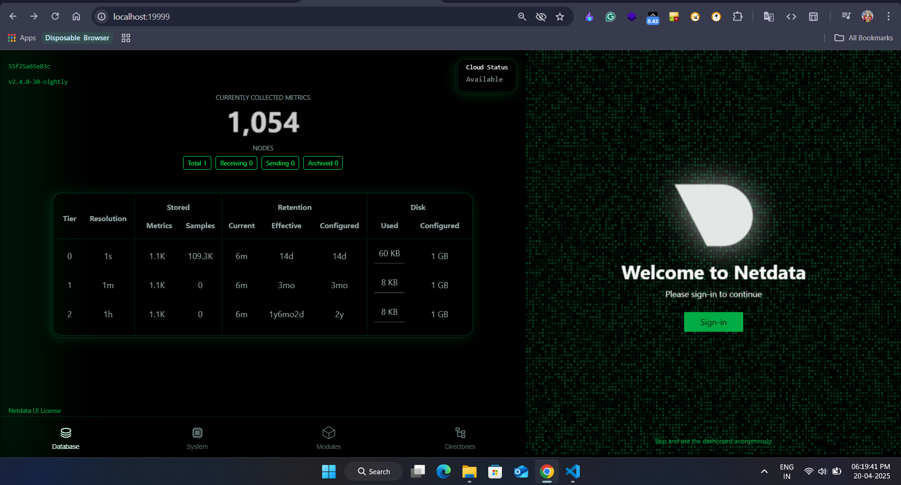
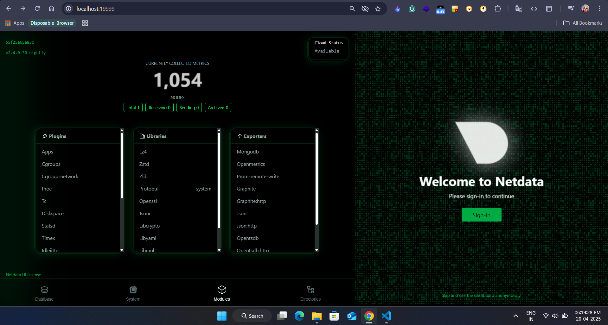
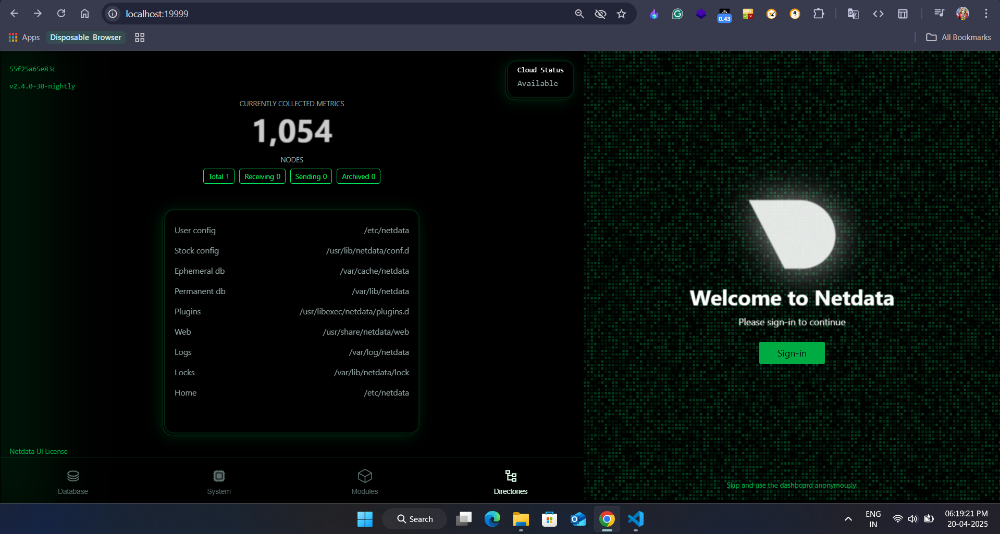
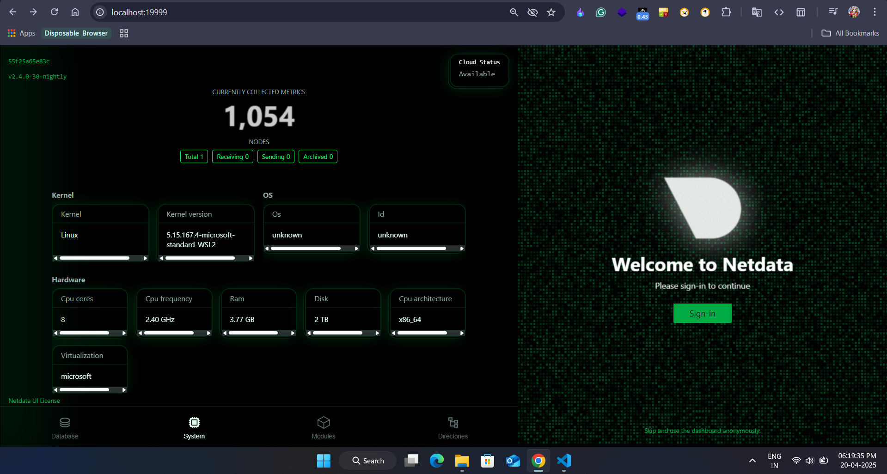

Netdata System Monitoring Setup (Windows + Docker)
==================================================

📌 Objective
------------

Install and configure **Netdata** using Docker on a Windows system to monitor system resources and application metrics in real-time.

🧰 Tools Used
-------------

*   Docker Desktop for Windows
*   Netdata (Official Docker image)

📦 Step-by-Step Setup
---------------------

### 1\. Install Docker Desktop

Download and install Docker Desktop from [docker.com](https://www.docker.com/products/docker-desktop).

Enable WSL2 or Hyper-V during installation and reboot if required.

### 2\. Run Netdata Container

Open **PowerShell** or **Windows Terminal** and execute:

    docker run -d --name=netdata -p 19999:19999 --cap-add=SYS_PTRACE --security-opt apparmor=unconfined netdata/netdata

### 3\. Access Dashboard

Open your browser and navigate to:

    http://localhost:19999

### 4\. Monitor Metrics

*   CPU, RAM, Disk I/O
*   Network usage
*   Docker containers
*   System processes

### 5\. View Logs

Use the command below to inspect logs:

    docker logs netdata

### 6\. (Optional) Use Persistent Volumes

Create local folders and run with volume bindings:

    docker run -d --name=netdata -p 19999:19999 ^
      -v C:\netdata\config:/etc/netdata ^
      -v C:\netdata\lib:/var/lib/netdata ^
      -v C:\netdata\cache:/var/cache/netdata ^
      --cap-add=SYS_PTRACE --security-opt apparmor=unconfined netdata/netdata

🖼 Screenshot
-------------

🎯 Outcome
----------

*   Lightweight, real-time monitoring setup
*   Dockerized Netdata instance with full metrics visibility
*   Easy access via browser at `localhost:19999`
